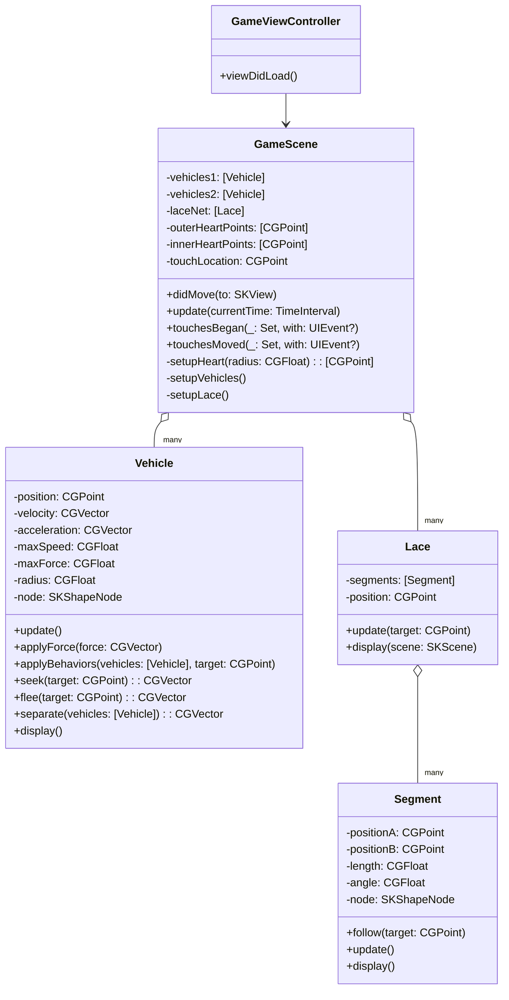

# TwinFlame HeartCurve Re-implementation Plan

## 1. Overview

This document outlines the plan to re-implement the "HeartCurve" p5.js project into the "TwinFlame" iOS project using Swift and SpriteKit. The original project creates an intricate, dynamic animation of two heart shapes formed by particles and connected by laces. This implementation will replicate the visual aesthetics and behavior of the original p5.js program.

## 2. Architecture

The iOS implementation will use **SpriteKit**, Apple's 2D game engine. SpriteKit is a natural choice for this project as it provides a scene-based structure, a rendering loop, and tools for creating custom shapes and animations, which align well with the concepts in the original p5.js sketch.

The core components of the p5.js project (`Vehicle`, `Lace`, `Segment`) will be ported to Swift classes. The main `GameScene.swift` file will manage the overall scene, the game loop (`update` method), and user interactions (touch events).

## 3. UML Class Diagram

Here is a UML class diagram illustrating the proposed architecture for the Swift/SpriteKit implementation.

## 4. Implementation Details

### 4.1. Project Setup

*   Create the following new Swift files in the `TwinFlame` group in Xcode:
    *   `Vehicle.swift`
    *   `Lace.swift`
    *   `Segment.swift`

### 4.2. Class Implementation

*   **`Vehicle.swift`**
    *   This class will be a direct port of `Vehicle.js`.
    *   It will manage the physics of a single particle (position, velocity, acceleration).
    *   It will not be a subclass of `SKNode`. Instead, it will have an `SKShapeNode` property (`node`) to represent the vehicle in the scene.
    *   The `seek`, `flee`, and `separate` methods will be implemented using `CGVector` for vector math.
    *   The `update` method will apply the forces and update the position of the `node`.

*   **`Segment.swift`**
    *   This class will represent a segment of the lace.
    *   It will also not be a subclass of `SKNode`, but will have a `SKShapeNode` property (`node`) to draw the line segment. The line can be drawn by creating a `CGPath` and setting it to the `path` property of the `SKShapeNode`.
    *   The `follow` method will implement the inverse kinematics logic to follow a target point.

*   **`Lace.swift`**
    *   This class will manage an array of `Segment` objects.
    *   It will be responsible for creating the chain of segments.
    *   The `update(target: CGPoint)` method will call the `follow` method on its segments to update the lace's position.

### 4.3. GameScene Implementation

*   **`GameScene.swift`**
    *   `didMove(to:)`: This method will be the equivalent of p5.js's `setup()`. Here, you will:
        *   Define the heart shapes by porting the parametric equation from `setupHeart`. The points will be stored in `outerHeartPoints` and `innerHeartPoints` as `[CGPoint]`.
        *   Instantiate the `Vehicle` objects and add their `node`s to the scene.
        *   Instantiate the `Lace` objects.
    *   `update(_:)`: This is the main game loop, equivalent to p5.js's `draw()`. In each frame, you will:
        *   Update the target points for the vehicles based on time, alternating between the inner and outer heart shapes.
        *   Call `applyBehaviors` on each `Vehicle`.
        *   Call `update` on each `Vehicle`.
        *   Update the `Lace` objects, connecting the corresponding vehicles.
        *   Handle the "flee" behavior from the user's touch location.
    *   `touchesBegan` / `touchesMoved`: These methods will update a `touchLocation` property that will be used by the `flee` behavior in the `Vehicle` class.

### 4.4. Interaction

*   The mouse interaction in the p5.js sketch (`flee` from `mouseX`, `mouseY`) will be translated to touch interaction. The `GameScene` will store the location of the user's touch, and the `Vehicle`s will flee from that point.

## 5. Milestones

1.  **Project Setup**: Create the new Swift files (`Vehicle.swift`, `Lace.swift`, `Segment.swift`).
2.  **Vehicle Implementation**: Implement the `Vehicle` class with its physics and behaviors. Test by making a single vehicle seek a fixed point.
3.  **Heart Shape**: Implement the `setupHeart` logic in `GameScene` to generate the points for the heart shapes.
4.  **Multiple Vehicles**: Create multiple vehicles and have them seek the points on the heart shapes.
5.  **Segment and Lace Implementation**: Implement the `Segment` and `Lace` classes. Test by creating a single lace that follows a moving target.
6.  **Integration**: Combine the vehicles and laces. Each pair of vehicles should be connected by a lace.
7.  **Interaction**: Implement the touch-based "flee" behavior.
8.  **Refinement**: Fine-tune the animation parameters (speed, forces, colors, etc.) to match the original p5.js project.
